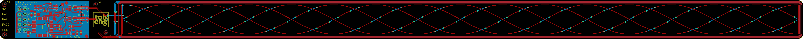

# inductive sensor with STM32

This is a open source inductive sensor using a STM32G030K8T6 MCU.

---

PCB has been made with Eagle, Software with STM32CubeIDE.

The sensor is capable of sub mm accuracy. There might be linearity errors.

The TX coil is driven with 125kHz. A new measurement can be made every 50ms. The speed is limited mainly due to lack of processing power and FPU. During one measurement, the TX coil is ON for 2.8ms. During the short ON time, data is gathered which is later processed. The amount which can be gathered is limited by RAM available.

